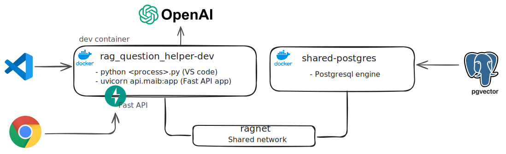

# RAG Question Helper

A fully end-to-end system for parsing GCSE question papers from PDF into structured JSON, generating vector embeddings, storing them in a PostgreSQL + pgvector database, and serving similarity search via an interactive web front-end.

---

## 🏗️ System Architecture

                       ┌────────────────────┐
                       │   PDF Exam Papers  │
                       └────────┬───────────┘
                                │
               ┌────────────────────────────────────┐
               │   Text Extraction (PyMuPDF / fitz)  │
               └────────────────┬───────────────────┘
                                │
               ┌────────────────────────────────────┐
               │  Reconstruction (LLM: GPT-4-Turbo) │
               └────────────────┬───────────────────┘
                                │
               ┌────────────────────────────────────┐
               │   Deduplicated JSON Output Files    │
               └────────────────┬───────────────────┘
                                │
               ┌────────────────────────────────────┐
               │   Vector Generation (OpenAI Embedding) │
               └────────────────┬───────────────────┘
                                │
               ┌────────────────────────────────────┐
               │   PostgreSQL + pgvector DB Storage  │
               └────────────────┬───────────────────┘
                                │
               ┌────────────────────────────────────┐
               │   FastAPI Back-End Search API       │
               └────────────────┬───────────────────┘
                                │
               ┌────────────────────────────────────┐
               │  Front-End Web UI (HTML + JS)       │
               └────────────────────────────────────┘




---

## 🔎 End-to-End ETL Flow

### 🟢 1️⃣ Fully Automated Pipeline

```bash
python etl/full_pipeline.py sample_papers/Physics/Edexcel_Science_GCSE_Physics_2023.pdf Physics 2023
```

This will:

- Extract text from PDF
- Reconstruct questions via OpenAI GPT-4-Turbo
- Deduplicate and generate clean JSON
- Generate vector embeddings
- Insert into PostgreSQL + pgvector

---

## ⚙️ Manual Steps (If Needed)

### 1️⃣ Extract Text

```bash
python etl/extract_questions_fitz.py sample_papers/Physics/Edexcel_Science_GCSE_Physics_2023.pdf Physics 2023
```

### 2️⃣ Reconstruct Questions

```bash
python etl/reconstruct_questions.py output/Physics/Edexcel_Science_GCSE_Physics_2023/pages.txt Physics Edexcel_Science_GCSE_Physics_2023.pdf 2023
```

### 3️⃣ Ingest into Vector DB

```bash
python etl/ingest_questions.py output/Physics/Edexcel_Science_GCSE_Physics_2023/all_questions_deduped.json
```

---

## 🌐 Running Full-Stack App

### Start containers:

```bash
docker compose up --build
```

### Access UI:

Open: http://localhost:8000/search-ui

---

## 💻 Code Layout

```
.
├── ai/                # OpenAI API client wrapper
├── api/               # FastAPI app (search API + web UI)
├── db/                # PostgreSQL connection utilities
├── etl/               # Extraction + Reconstruction + Ingestion
├── templates/         # Front-end HTML (search.html)
├── sample_papers/     # PDF input files
├── output/            # Extracted data & reconstructed questions
├── .env               # Environment variables
├── Dockerfile
├── docker-compose.yml
└── requirements.txt
```

---

## 🚀 Deployment & Devcontainers

- Fully containerised via:
  - Dockerfile (Python + dependencies)
  - docker-compose.yml (Postgres + app stack)
  - .devcontainer/ (VSCode integration)

---

## ⚠️ Notes

- OpenAI key is required for both embeddings + reconstruction.
- PostgreSQL uses pgvector (vector(1536)) for storage.
- Prompt engineering for reconstruction is highly tuned — avoid changes.

---

Built with ❤️ to help GCSE practice smarter!
